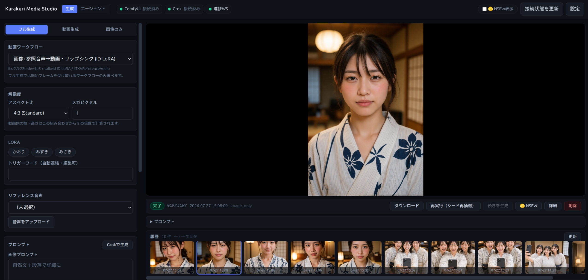

# Karakuri Media Studio

`workflow/` 配下の ComfyUI ワークフロー（画像 4 種 / 動画 8 種 / 音声 2 種）を Web UI から実行し、
プロンプト作成を Grok に委譲、生成物と履歴をローカルに保存する個人利用向けのメディア生成アプリです。



- バックエンド: Python 3.12 + FastAPI + SQLite（`app.db`）
- フロントエンド: React + Vite + Tailwind（ダークテーマの SPA。「生成」と「エージェント」の 2 ビュー + 設定ページ）
- 生成本体: ComfyUI（ローカル / LAN 上の別 PC / Comfy Cloud）
- プロンプト生成: Grok Build CLI（サブスクリプション認証、API キー不要）

仕様・設計・API の詳細は [`docs/SPEC.md`](docs/SPEC.md)、エージェントモードは
[`docs/AGENT-MODE.md`](docs/AGENT-MODE.md)、プロンプト実例は
[`docs/prompt-samples.md`](docs/prompt-samples.md) にあります。この README は
「起動して使い始めるまで」に絞っています。

---

## 前提条件

| 依存 | 内容 |
|---|---|
| ComfyUI | 稼働中であること（既定 `http://127.0.0.1:8188`）。Comfy Cloud も可 |
| custom nodes | ResolutionSelector / ComfySwitchNode / CustomCombo / LTXV 系 / ComfyMath / ResizeImage 系 / ResizeAndPadImage / MoGe 系 / LoadVideo / Video Slice など、`workflow/` 配下のワークフローが使うノード一式 |
| モデル | **使うワークフローのぶんだけ**あれば十分です（各テンプレートの既定ファイル名は SPEC §3.3）。足りないものは後述の「不足モデルの自動ダウンロード」で取得できます |
| grok CLI | `curl -fsSL https://x.ai/cli/install.sh \| bash` でインストール後、一度 `grok` を起動してブラウザでサインイン（SuperGrok / X Premium+ のサブスクリプションで利用可） |
| ffmpeg | 動画からのラストフレーム抽出に使用（PATH にあること） |
| Python / Node.js | 3.12 以上 / 18 以上 |

不足している custom node やワークフローのノード ID ズレは、起動時とヘッダーの接続
インジケーター（`GET /api/health`）が検出して警告します。

---

## セットアップと起動

```bash
git clone https://github.com/KarakuriAgent/karakuri-media-studio.git
cd karakuri-media-studio

./run.sh          # 本番: 依存を整えて frontend をビルドし http://127.0.0.1:8000 で起動
./run.sh --dev    # 開発: uvicorn --reload (:8000) と vite dev (:5173) を並行起動
```

`run.sh` は初回に venv 作成・`npm install`・`npm run build` まで面倒を見ます。
待受などの設定は環境変数か、リポジトリ直下の `.env`（gitignore 済み）で渡します
（シェルの環境変数が優先）。

```bash
# .env
HOST=0.0.0.0
PORT=8080
COMFY_MODELS_DIR=/path/to/ComfyUI/models   # 任意（後述の自動ダウンロード用）
```

### Docker (docker compose) で起動する

```bash
npm --prefix frontend install && npm --prefix frontend run build  # 初回のみ

./compose.sh up -d --build   # 起動
./compose.sh logs -f         # ログ
./compose.sh down            # 停止
```

「ランタイムだけコンテナ、データとワークスペースはローカル」という設計で、`compose.sh` が
リポジトリをホストと同じ絶対パスにマウントし、コンテナをローカルユーザーの `UID:GID` で
動かします（`./run.sh` 実行と行き来でき、生成ファイルの所有者も変わりません）。

- grok CLI はホストの `~/.grok` をマウントして使うので、**事前にホスト側でインストールと
  サインイン**を済ませてください
- ComfyUI に `http://127.0.0.1:8188` を使っている場合、コンテナからは届きません。設定画面の
  ComfyUI URL を `http://host.docker.internal:8188` か LAN の IP に変えてください
- `.env` の `COMFY_MODELS_DIR` は、同じ絶対パスでコンテナにもマウントされます
- `docker compose` を直接使うときは、リポジトリの実体パスから
  `UID=$(id -u) GID=$(id -g) docker compose up -d` のように実行してください
  （サービス名は `media-studio`。旧名 `video-studio` のコンテナが残っていれば `docker rm -f` で片付けます）

### 開発

```bash
cd backend && ../.venv/bin/pytest                  # バックエンド
cd frontend && npm run build && npx vitest run     # フロントエンド（型チェック込み）
```

`run.sh` を使わず手で起動する場合:

```bash
python3.12 -m venv .venv && .venv/bin/pip install -r backend/requirements.txt
cd frontend && npm install && npm run build && cd ..
PYTHONPATH=backend .venv/bin/uvicorn app.main:app --port 8000
```

---

## 不足モデルの自動ダウンロード（オプトイン）

ワークフローが使うモデルが手元に無いとき、設定ページからダウンロードして ComfyUI の
models ディレクトリへ直接置けます（ComfyUI の再起動は不要）。**`.env` に
`COMFY_MODELS_DIR` を書いたときだけ**設定画面に現れる機能で、書かなければ UI には一切出ません。

1. `.env` に `COMFY_MODELS_DIR=/path/to/ComfyUI/models` を書く
2. 再起動する（ホスト: `./run.sh` / Docker: `./compose.sh up -d` — compose が同じパスを
   コンテナにマウントします）
3. gated な Hugging Face リポジトリや要ログインの Civitai ファイルを使うなら、設定ページの
   「接続 / Grok」タブで **Hugging Face トークン** / **Civitai APIキー** を入れる
4. 「モデル」タブで **未検出** バッジが付いた行に URL を入れて [DL]。進捗はその行に出ます

保存先（`checkpoints` / `diffusion_models` / `loras` など）はローダーの種類から自動で決まります。
Comfy Cloud 接続では ComfyUI のファイルシステムに届かないため使えません（UI にも出ません）。
配置先の対応表や認証・リダイレクトの扱いは SPEC §3.3 を参照してください。

---

## ComfyUI を RunPod で動かす（オプトイン）

手元に GPU が無い / 大きいモデルを回したい場合、ComfyUI を **RunPod の Pod
（GPU 時間貸し）**に置けます。ジョブを実行したときに ComfyUI へ繋がらなければ
アプリが Pod を立ち上げ、繋がるまで待ってから投入します。使い終わった Pod は
Pod 自身の watchdog がアイドル 10 分で terminate するので、消し忘れで課金が
続くことはありません。

1. RunPod に Network Volume とテンプレートを登録する（イメージは公開済みの
   `ghcr.io/karakuriagent/karakuri-comfyui:latest` をそのまま使えばビルド不要）
2. 設定 →「接続 / Grok」で **RunPod の Pod を自動起動する** をオンにし、
   API キー / テンプレート ID / GPU 種別 / Network Volume ID を入れる
3. ComfyUI URL には Pod の Cloudflare Tunnel のホスト名を入れる

セットアップ手順は
[`docs/RUNPOD-QUICKSTART.md`](docs/RUNPOD-QUICKSTART.md)（公開イメージを
そのまま使う人向け）にまとめてあります。イメージを自分で変えたい場合の
ビルド・push を含むフル手順は [`deploy/runpod/README.md`](deploy/runpod/README.md)、
設計上の決め事は SPEC §5.1 を参照してください。

---

## 使い方

左ペインでモードとワークフローを選び、プロンプトや必要な入力を埋めて「実行」。進捗は
WebSocket で右ペインにリアルタイム表示され、完了すると生成物がプレビューされます。
**現在のモード・ワークフローが使わない項目はフォームに出ません**（入力値は保持され、戻れば復元されます）。

| モード | 内容 |
|---|---|
| 画像＋動画 | 画像を生成し、その画像を開始フレームにして動画を生成（同一ジョブで 2 段実行。画像は 1 段目で確定保存） |
| 動画生成 | 動画ワークフローを単発実行 |
| 画像のみ | 画像生成だけを実行（開始フレーム候補の量産に） |
| 音声 | 音声ワークフローを単発実行（画像・動画とは連結しない） |

**画像**は Krea 2 turbo（既定）/ Anima / Z-Image turbo / Qwen-Image Edit 2511（画像編集。参照画像必須）から選びます。

**動画**は LTX 2.3 の 7 種と Wan Dancer から選び、必要な入力の欄だけが出ます。

| ワークフロー | 必要な入力 |
|---|---|
| テキスト→動画 (t2v) | なし |
| 画像→動画 (i2v) | 開始フレーム |
| 画像+音声→動画 (ia2v) | 開始フレーム / 音声 |
| リップシンク (ID-LoRA)（既定） | 開始フレーム / リファレンス音声 |
| 最初と最後のフレーム指定 (flf2v) | 最初 / 最後のフレーム |
| リファレンスシート (IC-LoRA) | リファレンスシート画像 |
| 参照動画からモーション転写 (IC-LoRA + MoGe) | 開始フレーム / 参照動画 |
| 画像+音声→ダンス動画 (Wan Dancer) | 開始フレーム / 音声 |

**音声**は ACE-Step 1.5 XL（歌もの・インスト。歌詞や BPM を指定）と
Stable Audio 3 Medium（効果音・環境音・単一楽器）の 2 種です。

各ワークフローの用途・音声の扱い・プロンプトの書き方は SPEC §2 を参照してください。

### 入力ファイル

画像・音声・参照動画は**ドラッグ&ドロップ**か [アップロード] で指定でき、`assets/` に
保存されて再利用できます。**[履歴から選択]** で過去の生成物を、**[ライブラリから選択]** で
取っておいた素材をそのまま入力に使えます。

### ライブラリ

履歴はジョブを消すと成果物も消えますが、**ライブラリ**は「残す」と決めた画像・動画・音声を
置いておく棚です（`library/`）。結果ペインや履歴詳細の [☆ ライブラリに登録] で保存でき、
タグ（未指定なら Grok が日本語タグを自動生成）と検索で探せます。

### Grok チャットでプロンプト作成

「Grokで生成」ボタンでチャットモーダルが開きます。フォームの現在値を踏まえて Grok が
不足情報を質問し、まとまったら画像 / 動画 / 音声プロンプトの案を提示 → [フォームに反映] で
プロンプト欄に入ります。

### エージェントモード

ヘッダーの「エージェント」タブでは、Grok が**同僚のように制作を回します**。「ダンス動画を 3 本」の
ような目標を伝えるとプランを提示し、**承認するまで生成しません**。承認後はジョブを順に実行し、
結果を検分して再抽選・続き生成まで自分で進めます（⏹ でいつでも停止）。詳細は
[`docs/AGENT-MODE.md`](docs/AGENT-MODE.md)。

### LoRA

設定画面の「LoRA 管理」タブで人物 LoRA を登録します（表示名 / ファイル名 / 対象（画像用・動画用）/
画像用はモデルファミリー / トリガーワード / 既定強度 / 既定リファレンス音声 / サンプル画像）。
生成フォームでは複数を同時適用でき、**選択中の画像ワークフローと同じファミリーの LoRA だけ**が候補に出ます。

### 履歴・NSFW

履歴ギャラリーのサムネイルから詳細を開き、**再実行**（seed ランダム化）・**続きを生成**
（ラストフレームを開始フレームに）・**削除**ができます。履歴は無制限に保存され、削除は手動のみです。
ジョブとセッションには NSFW フラグが付き（Grok の自動判定、手動上書き可）、ヘッダーの NSFW トグルが
オフのあいだは履歴・ビューアから除外されます（トグルはタブを開き直すと必ずオフに戻ります）。

---

## 設定

ヘッダーの「設定」から開き、`runtime/config.json` に保存されます。タブは「接続 / Grok」
「LoRA 管理」「モデル」の 3 つです。

| キー | 内容 | 既定 |
|---|---|---|
| `comfy_url` | ComfyUI の接続先 URL | `http://127.0.0.1:8188` |
| `comfy_api_key` | 認証ヘッダー用 API キー（Comfy Cloud など） | 空 |
| `grok_command` / `grok_model` | grok CLI のコマンドと使用モデル | `grok` / `grok-4.5` |
| `hf_token` / `civitai_api_key` | モデルダウンロード用のトークン | 空 |
| `model_overrides` / `model_choices` | モデルファイル名の上書きと、実行ごとに選べる候補リスト | `{}` |
| `runpod_*` | RunPod Pod の自動起動（有効化 / APIキー / テンプレート ID / GPU 種別 / Network Volume ID） | 無効 |
| `agent_*` | エージェントの CLI フラグ・タイムアウト・自走上限（設定ページには出ません） | SPEC 参照 |

**モデルタブ**では、各ワークフローのモデルファイル名を環境に合わせて上書きできます
（既定値はテンプレートの値＝ Comfy Cloud で動作確認済みの構成）。同じ行の**候補リスト**に
別のファイル名を足すと、そのスロットは生成フォームとエージェントで**実行ごとに切り替え**られる
ようになります。詳細は SPEC §3.3。

**Comfy Cloud** を使う場合は `comfy_url` に `https://cloud.comfy.org`、`comfy_api_key` に
[発行したキー](https://docs.comfy.org/development/cloud/overview)を設定します（API アクセスは
Standard 以上のプランが必要）。

---

## よくあるトラブル

| 症状 | 対処 |
|---|---|
| ヘッダーの接続インジケーターが赤い | ComfyUI が起動しているか、`comfy_url` が正しいか確認。Docker からは `127.0.0.1` が届かないので `host.docker.internal` か LAN IP に |
| ジョブが「ファイルが見つからない」で失敗する | モデルのファイル名が環境と違う可能性。設定の「モデル」タブで上書きするか、[DL] で取得（SPEC §3.3） |
| custom node 不足・ノード ID ズレの警告が出る | 不足ノードを ComfyUI に導入。テンプレートを差し替えた場合は `backend/app/workflows.py` のマニフェストを合わせる（SPEC §3.0） |
| Grok が応答しない / 認証エラー | ホスト側で `grok` を一度起動してサインイン。Docker では `~/.grok` のマウントが必要 |
| ラストフレームが取れない | `ffmpeg` が PATH にあるか確認 |

---

## 注意事項

- 本アプリは成人向けコンテンツをローカル生成する個人利用ツールです。生成物・プロンプトは
  すべてローカルにのみ保存され、ComfyUI と Grok CLI 以外へは送信されません
- LoRA で実在人物を無断利用しないでください（利用者責任）
- grok CLI はベータのため出力形式が変わる可能性があります
- 生成物 (`outputs/`, `assets/`, `library/`)、`app.db`、`runtime/`、`.venv/`、`node_modules/`、
  `frontend/dist/` はすべて `.gitignore` 済みです
